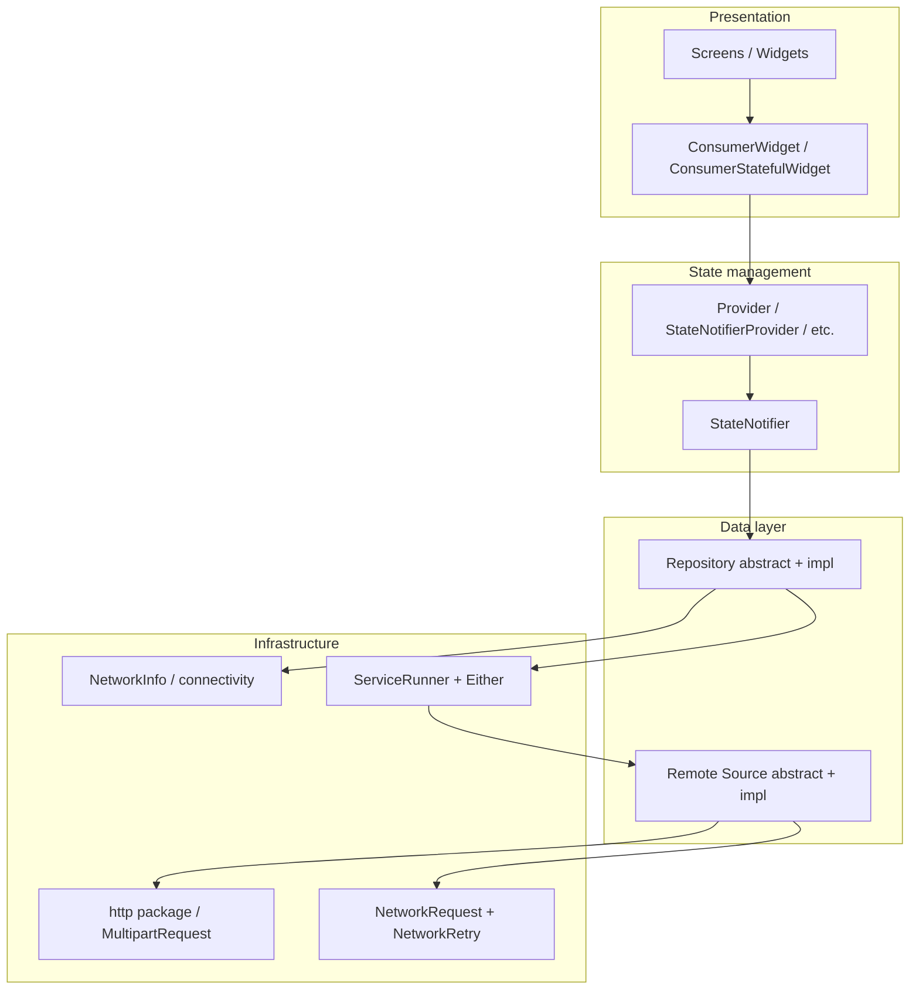

# DaBible — Riverpod architecture reference

This document describes how this Flutter app is structured so you can reuse the same patterns in a new project.

---

## High-level architecture

The app follows **clean-ish layering**: **UI (features)** → **Riverpod providers** → **repositories** → **remote sources** → **HTTP / APIs**. Shared **models** and **core** utilities sit beside features.



**Typical flow**

1. A **screen** uses `ref.watch` / `ref.read` on a **provider** (often a `StateNotifierProvider`).
2. The **notifier** calls a **repository** method.
3. The **repository** uses `ServiceRunner.tryRemoteandCatch` (or similar) and returns `Either<Failure, T>` from **dartz**.
4. The **repository** delegates HTTP to a **source** implementation (`*SourceImpl`) that uses `NetworkRequest`, tokens from `SecureStorage`, etc.
5. **Models** (JSON with `json_serializable` where used) map API responses to Dart types.

---

## Folder structure (`lib/`)

| Area | Purpose |
|------|---------|
| `main.dart` | `runApp(ProviderScope(child: MyApp()))` — Riverpod root |
| `config/` | Routes (`config/routes/`), theme |
| `constants/` | Colors, assets, theme data |
| `core/` | Failures, `ServiceRunner`, network request/retry, `NetworkInfo`, API endpoints |
| `features/` | **Feature-first UI**: `auth`, `home`, `books`, `create`, etc. Each may have `views/`, `providers/`, `states/` |
| `models/` | DTOs / entities (request/response), grouped by domain |
| `repository/` | Abstract + `*RepositoryImpl` — business-facing API, returns `Either` |
| `source/` | Abstract + `*SourceImpl` — raw HTTP / multipart calls |
| `providers/` | Global providers: `repo_provider.dart`, `source_provider.dart`, `theme_provider.dart`, … |
| `common/` | Reusable widgets and helpers |
| `modules/` | e.g. `secure_storage` |
| `widgets/` | Shared widgets |

**Convention for a new feature**

```
lib/features/<feature_name>/
  views/           # screens
  providers/       # Riverpod provider definitions (often thin)
  states/          # StateNotifier + *State (sealed / freezed-style classes)
```

Repositories and sources stay **global** under `lib/repository/` and `lib/source/` and are wired in `lib/providers/repo_provider.dart` and `lib/providers/source_provider.dart`.

---

## Key packages (from `pubspec.yaml`)

| Package | Role |
|---------|------|
| `flutter_riverpod` | Dependency injection + state (`ProviderScope`, `StateNotifierProvider`, `ConsumerWidget`) |
| `http` | REST calls, `MultipartRequest` |
| `dartz` | `Either<Failure, T>` for repository results |
| `json_annotation` + `json_serializable` | Code generation for models (`*.g.dart`) |
| `connectivity_plus` | Used with `NetworkInfo` before remote calls |
| `shared_preferences` / custom `SecureStorage` | Tokens and user data |
| `flutter_dotenv` | Env / secrets (if used) |
| `sizer` | Responsive sizing at app root |
| `intl` | Formatting |

Other packages (audio, image_picker, etc.) are feature-specific; the **spine** of the app is **Riverpod + repository + source + Either**.

---

## Boilerplate: app entry

```dart
import 'package:flutter/material.dart';
import 'package:flutter_riverpod/flutter_riverpod.dart';

void main() {
  WidgetsFlutterBinding.ensureInitialized();
  runApp(
    const ProviderScope(
      child: MyApp(),
    ),
  );
}

class MyApp extends ConsumerWidget {
  const MyApp({super.key});

  @override
  Widget build(BuildContext context, WidgetRef ref) {
    // final theme = ref.watch(themeModeProvider);
    return MaterialApp(
      title: 'My App',
      home: const HomeScreen(),
    );
  }
}
```

---

## Boilerplate: feature state + notifier

**`lib/features/example/states/example_state.dart`** (pattern used across the app)

```dart
import 'package:dabible/core/failures/failures.dart';

sealed class ExampleState {}

class ExampleInit extends ExampleState {}

class ExampleLoading extends ExampleState {}

class ExampleSuccess extends ExampleState {
  final String data;
  ExampleSuccess(this.data);
}

class ExampleFailure extends ExampleState {
  final Failure failure;
  ExampleFailure(this.failure);
}
```

**`lib/features/example/states/example_notifier.dart`**

```dart
import 'package:dabible/core/failures/failures.dart';
import 'package:dabible/features/example/states/example_state.dart';
import 'package:dabible/providers/repo_provider.dart';
import 'package:dabible/repository/example_repository.dart';
import 'package:flutter_riverpod/flutter_riverpod.dart';

class ExampleNotifier extends StateNotifier<ExampleState> {
  final ExampleRepository _repo;

  ExampleNotifier(Ref ref)
      : _repo = ref.read(exampleRepositoryProvider),
        super(ExampleInit());

  Future<void> load() async {
    state = ExampleLoading();
    final result = await _repo.fetchSomething();
    result.fold(
      (l) => state = ExampleFailure(l),
      (r) => state = ExampleSuccess(r),
    );
  }

  void reset() => state = ExampleInit();
}
```

**`lib/features/example/providers/example_provider.dart`**

```dart
import 'package:dabible/features/example/states/example_notifier.dart';
import 'package:flutter_riverpod/flutter_riverpod.dart';

final exampleNotifierProvider =
    StateNotifierProvider<ExampleNotifier, ExampleState>(
  (ref) => ExampleNotifier(ref),
);
```

---

## Boilerplate: repository (abstract + impl + provider)

**`lib/repository/example_repository.dart`**

```dart
import 'package:dabible/constants/error_strings.dart';
import 'package:dabible/core/failures/failures.dart';
import 'package:dabible/core/network_info/network_info.dart';
import 'package:dabible/core/runner/service.dart';
import 'package:dabible/providers/source_provider.dart';
import 'package:dabible/source/example_source.dart';
import 'package:dartz/dartz.dart';
import 'package:flutter_riverpod/flutter_riverpod.dart';

abstract class ExampleRepository {
  Future<Either<Failure, String>> fetchSomething();
}

class ExampleRepositoryImpl implements ExampleRepository {
  final NetworkInfo _networkInfo;
  final ExampleSource _remote;

  ExampleRepositoryImpl({required Ref ref})
      : _remote = ref.read(exampleSourceProvider),
        _networkInfo = ref.read(networkInfoProvider);

  @override
  Future<Either<Failure, String>> fetchSomething() async {
    final sR = ServiceRunner<Failure, String>(_networkInfo);
    return sR.tryRemoteandCatch(
      call: _remote.getData(),
      errorTitle: ErrorStrings.errorMakingRequest,
    );
  }
}
```

Register in **`lib/providers/repo_provider.dart`**:

```dart
final exampleRepositoryProvider = Provider<ExampleRepository>(
  (ref) => ExampleRepositoryImpl(ref: ref),
);
```

---

## Boilerplate: remote source

**`lib/source/example_source.dart`**

```dart
import 'package:dabible/core/api/api_endpoints.dart';
import 'package:dabible/core/network_request/network_request.dart';
import 'package:dabible/core/network_retry/network_retry.dart';
import 'package:dabible/modules/secure_storage.dart';
import 'dart:io';

abstract class ExampleSource {
  Future<String> getData();
}

class ExampleSourceImpl implements ExampleSource {
  final NetworkRequest networkRequest;
  final NetworkRetry networkRetry;

  ExampleSourceImpl({
    required this.networkRequest,
    required this.networkRetry,
  });

  @override
  Future<String> getData() async {
    final token = await SecureStorage().tokenRead();
    if (token == null) throw Exception('Unauthorized');

    final url = '${Endpoint.apiv3}example';
    final response = await networkRetry.networkRetry(
      () => networkRequest.get(
        url,
        headers: {
          HttpHeaders.acceptHeader: 'application/json',
          HttpHeaders.authorizationHeader: 'Bearer $token',
        },
      ),
    );
    // parse body → return domain string
    return response.body;
  }
}
```

Register in **`lib/providers/source_provider.dart`**:

```dart
final exampleSourceProvider = Provider<ExampleSource>(
  (ref) => ExampleSourceImpl(
    networkRequest: ref.read(networkRequestProvider),
    networkRetry: ref.read(networkRetryProvider),
  ),
);
```

---

## Boilerplate: screen using the notifier

```dart
import 'package:flutter/material.dart';
import 'package:flutter_riverpod/flutter_riverpod.dart';

class ExampleScreen extends ConsumerStatefulWidget {
  const ExampleScreen({super.key});

  @override
  ConsumerState<ExampleScreen> createState() => _ExampleScreenState();
}

class _ExampleScreenState extends ConsumerState<ExampleScreen> {
  @override
  void initState() {
    super.initState();
    WidgetsBinding.instance.addPostFrameCallback((_) {
      ref.read(exampleNotifierProvider.notifier).load();
    });
  }

  @override
  Widget build(BuildContext context) {
    final state = ref.watch(exampleNotifierProvider);

    return Scaffold(
      appBar: AppBar(title: const Text('Example')),
      body: switch (state) {
        ExampleInit() => const Center(child: Text('Tap refresh in initState')),
        ExampleLoading() => const Center(child: CircularProgressIndicator()),
        ExampleSuccess(:final data) => Center(child: Text(data)),
        ExampleFailure(:final failure) => Center(child: Text(failure.message)),
      },
    );
  }
}
```

---

## Core pieces to copy into a new project

1. **`ProviderScope`** wrapping `MaterialApp` (or root widget).
2. **`ServiceRunner`** + **`Either`** in repositories for consistent error handling.
3. **`Failure`** hierarchy under `lib/core/failures/`.
4. **`NetworkInfo`** + connectivity check before remote calls (as in this repo).
5. **`Endpoint.apiv3`** (or your base URL) in `lib/core/api/api_endpoints.dart`.
6. **Central `repo_provider.dart` / `source_provider.dart`** so you do not instantiate repositories manually in widgets.

---

## Optional: checklist for a greenfield app

- [ ] Add `flutter_riverpod`, `http`, `dartz`, `json_annotation`, `build_runner`, `json_serializable`
- [ ] Create `core/` (failures, network, runner)
- [ ] Add `ProviderScope` in `main.dart`
- [ ] For each API area: `Source` → `Repository` → `StateNotifier` → `Provider` → screen
- [ ] Keep **widgets thin**; put side effects in notifiers or repositories

---

*This README is a structural guide derived from the DaBible codebase. Adjust names (`Example*`) to your domain and align HTTP details with your API.*
